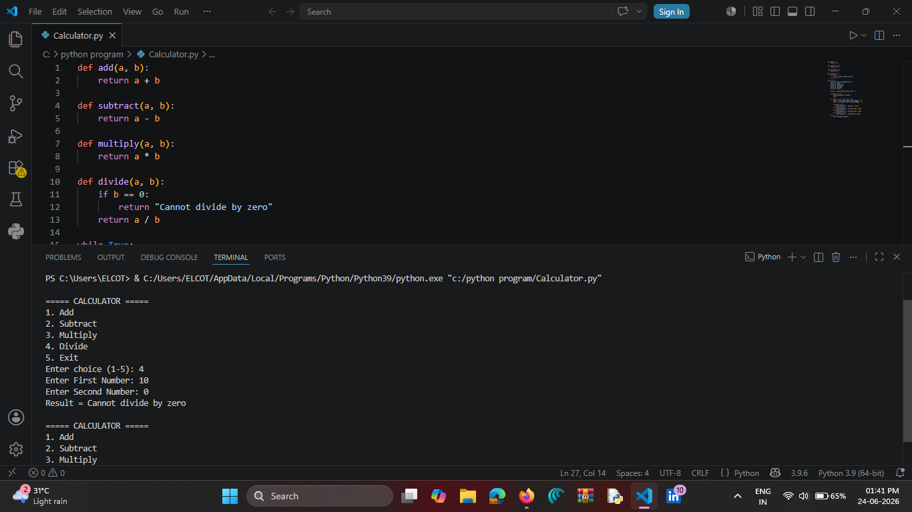

# Python Calculator

A simple command-line calculator built using Python.

## Features

* Addition
* Subtraction
* Multiplication
* Division
* Division by zero handling

## Technologies Used

* Python 3

## Screenshot

## Author

Chanthuru
